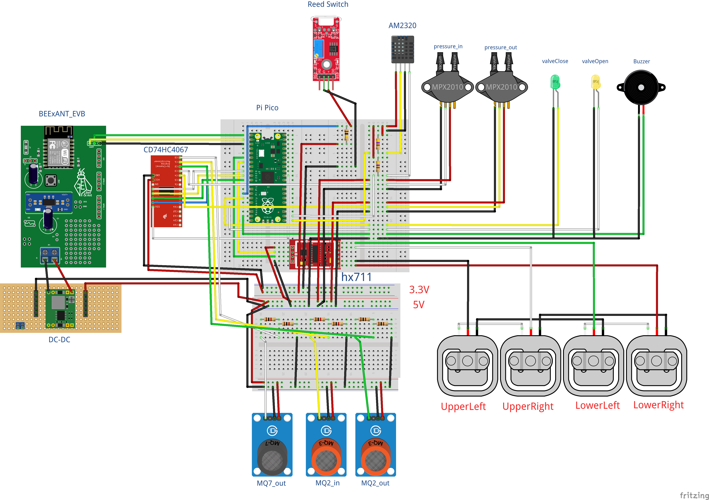

# 智能燃器系統

感測瓦斯桶重量、空氣溫度濕度、瓦斯洩漏偵測、管線洩漏偵測

## 安裝

1. 將 [micropython](https://github.com/cmsg-iot/nttu-ta-develop/tree/master/Raspberry-Pi-Pico/projects/gas-detected-system/micropython) 中的檔案上傳至 `Raspberry Pi Pico` 中

2. 依照下圖線路配置元件後執行 

3. 開啟網頁編輯器 http://web.sgiot.com.tw

4. 參考 [網頁參數檔](https://github.com/cmsg-iot/cmsg-iot.github.io/tree/main/json) 將 [gas-system.json](./web/gas-system.json) 檔案匯入並開啟

5. 連上 ESP8266 Wi-Fi (預設 wifi 名稱 NTTU_AP)

6. 使用 `Create WS`，輸入 `10.10.10.10` 位址後，待左上狀態顯示綠燈表示已連接

7. 點擊 `RUN` 按鈕即可看到完整系統網頁
